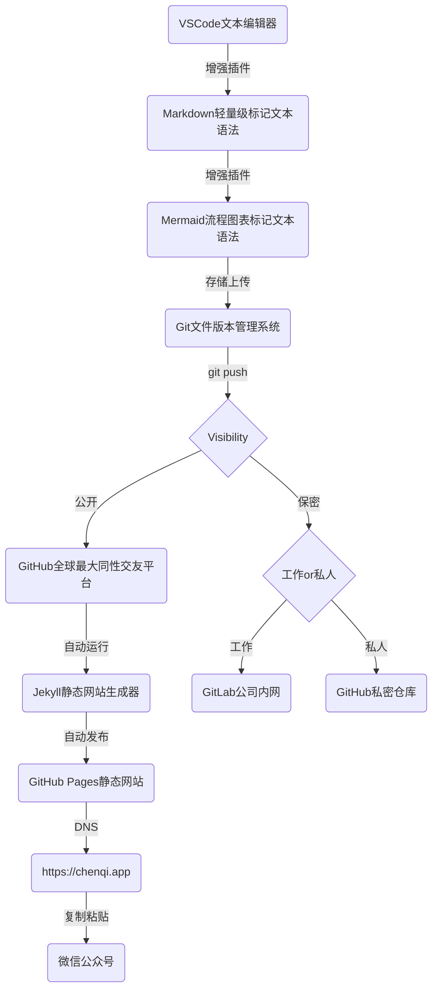

## Mermaid

[Mermaid](https://mermaid-js.github.io/mermaid/#/)是一个从文本生成图形的工具。目前它可以生成流程图（Flowchart），序列图（Sequence Diagram），类图（Class Diagram），状态图（State Diagram），甘特图（Gantt ）和饼图（Pie Chart）



- 在Jekyll项目中新建一个组件模板`mermaid.html`,在其中完成对mermaid的初始化



```html
<script>
  function initMermaid() {
    var config = {
      startOnLoad: true,
      theme: "forest",
      flowchart: {
        useMaxWidth: true,
        htmlLabels: true,
      },
    };
    mermaid.initialize(config);
    window.mermaid.init(
      undefined,
      document.querySelectorAll(".language-mermaid")
    );
  }
</script>

<script
  src="//cdnjs.cloudflare.com/ajax/libs/mermaid/8.6.0/mermaid.min.js"
  async
  onload="initMermaid()"
></script>

```



- 修改页面样式模版，在模版中添加对`marmaid.html`的引入



```liquid

  

```



- 在要使用图表的文章头部添加声明

```liquid
---
mermaid: true
---
```
